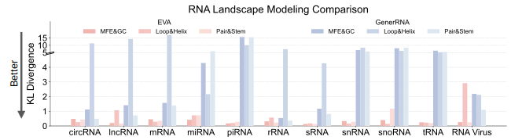
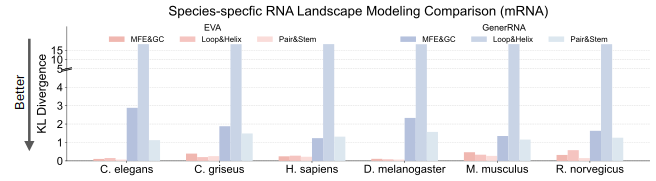
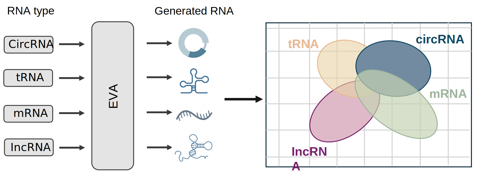
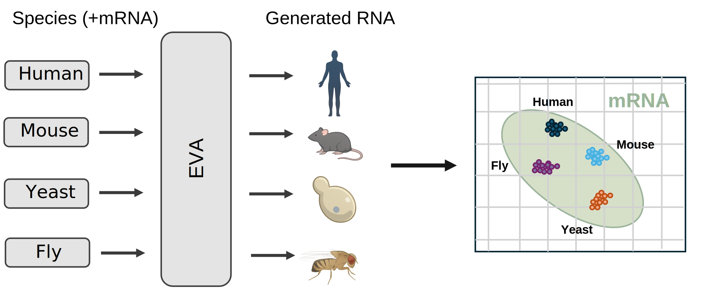
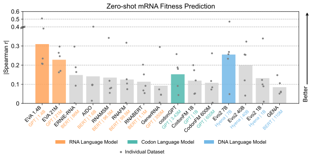
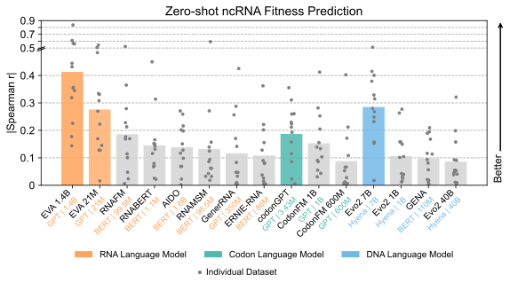

# EVA: A Generative Foundation Model for Universal RNA Modeling and Design

<div align="center">
  
</div>

<div align="center">

[](#)
[](https://huggingface.co/yanjiehuang/EVA1)
[](LICENSE)
[](http://223.109.239.35:3001/)

</div>

<div align="center">🧬 <i>A long-context generative foundation model for universal RNA sequence modeling and design across all domains of life.</i></div>

<br>

**EVA** (Evolutionary Versatile Architect) is a generative RNA foundation model trained on **RNAVerse v1**, a curated atlas of 114 million full-length RNA sequences spanning all domains of life. Built on a 1.4B-parameter decoder-only Transformer with a Mixture-of-Experts (MoE) backbone and an 8,192-token context window, EVA unifies RNA sequence scoring and controllable design within a single framework.

## Why Use EVA?

**10x Higher Modeling Accuracy Than Ever Before — At Both Sequence and Structure Level.**

<table>
  <tr>
    <td align="center">
      
      <br><i>RNA landscape modeling comparison</i>
    </td>
    <td align="center">
      
      <br><i>Species-specific RNA landscape modeling comparison</i>
    </td>
  </tr>
</table>

You should also consider EVA for the reasons as follows:

<table>
  <tr>
    <td>🔓</td>
    <td><b>Fully Open-Sourced</b></td>
    <td>All training data, model weights, and training details are publicly released — full transparency for the community to reproduce, build upon, and extend</td>
  </tr>
  <tr>
    <td>📏</td>
    <td><b>8x Larger Context Window</b></td>
    <td>8,192-token context window vs. ~1,024 in prior RNA models — enabling full-length RNA processing without truncation or information loss</td>
  </tr>
  <tr>
    <td>🗄️</td>
    <td><b>7x More Training Data</b></td>
    <td>Trained on RNAVerse v1 — 114M full-length RNA sequences across all domains of life (Eukaryota, Bacteria, Archaea, Viruses), 7.7x larger than the RNAcentral v25.0</td>
  </tr>
  <tr>
    <td>🏆</td>
    <td><b>SOTA Fitness Prediction</b></td>
    <td>Achieves state-of-the-art zero-shot fitness prediction on ncRNA and mRNA, no task-specific fine-tuning needed</td>
  </tr>
  <tr>
    <td>🎯</td>
    <td><b>10x+ RNA Generation Accuracy</b></td>
    <td>Over 10x improvement in RNA generation accuracy at both sequence and structure level compared to prior methods</td>
  </tr>
  <tr>
    <td>🧬</td>
    <td><b>11 RNA Types Supported</b></td>
    <td>Controllable generation across 11 RNA classes (mRNA, tRNA, rRNA, lncRNA, snRNA, snoRNA, miRNA, and more) conditioned on RNA type and taxonomic lineage</td>
  </tr>
  <tr>
    <td>⚙️</td>
    <td><b>Novel Architecture, Capabilities & Training</b></td>
    <td>1.4B-parameter MoE decoder-only Transformer with dual generation paradigms — CLM for de novo design & GLM for domain redesign — unified in a single model</td>
  </tr>
</table>

<br>


## Key Modules

| Module | Path | Description |
|--------|------|-------------|
| Model Architecture | `eva/` | MoE Transformer backbone (modeling, attention, MoE routing, causal LM head) |
| Lineage Tokenizer | `eva/lineage_tokenizer.py` | Tokenizer for taxonomic lineage strings |
| Generation CLI | `tools/generate.py` | Entry point for CLM and GLM sequence generation |
| Scoring CLI | `tools/predict.py` | Entry point for log-likelihood scoring |
| Directed Evolution | `tools/directed_evolution.py` | In-silico directed evolution pipeline |
| Generators | `tools/utils/generators/` | CLM autoregressive and GLM span-infilling implementations |
| Scorers | `tools/utils/scorers/` | Sequence scoring logic and batch workers |
| Condition Control | `tools/utils/conditions/` | RNA type and taxonomic lineage conditioning |
| Model Loader & Sampler | `tools/utils/model/` | Checkpoint loading and sampling strategies |
| Config Templates | `config/` | YAML configuration examples for generation, scoring, and directed evolution |

<br>

### Our Journey with EVA Starts Here 👋

> Click below to expand the **Table of Contents** and explore each section in detail.

<details>
<summary><kbd>Table of Contents</kbd></summary>

<br/>

- [Quick Start](#quick-start)
- [Condition Control](#condition-control)
  - [RNA Types](#rna-types)
  - [Species/Lineage](#specieslineage)
- [Generation](#generation)
  - [CLM](#clm)
    - [Unconditional Generation](#unconditional-generation)
    - [Conditional Generation](#conditional-generation)
    - [Continuation Mode](#continuation-mode)
  - [GLM](#glm)
    - [Unconditional Infilling](#unconditional-infilling)
    - [Conditional Infilling](#conditional-infilling)
    - [Span Parameters](#span-parameters)
  - [Sampling Parameters](#sampling-parameters)
- [Scoring](#scoring)
  - [RNA Mode](#rna-mode)
  - [Protein Mode](#protein-mode)
- [Directed Evolution](#directed-evolution)
  - [Usage](#usage)
  - [Key Parameters](#key-parameters)
- [Batch Processing with YAML](#batch-processing-with-yaml)
  - [Generation Config Example](#generation-config-example)
  - [Scoring Config Example](#scoring-config-example)
  - [Running](#running)
- [Input/Output Formats](#inputoutput-formats)
- [Data Availability](#data-availability)
  - [Model & Environment](#model--environment)
  - [Experiment & Benchmark Data](#experiment--benchmark-data)
  - [Auxiliary Data](#auxiliary-data)
- [Citation](#citation)
- [License](#license)

<br/>

</details>

<br>


## Quick Start

### 1. Pull Docker Image

**From Zenodo** (link coming soon):

```bash
# Download all split archives (part000-part011), then:
cat eva_latest.tar.gz.part* > eva_latest.tar.gz
docker load -i eva_latest.tar.gz
```

**Or build from Dockerfile:**

```bash
cd /data/yanjie_huang/eva/EVA1/docker
docker build -t eva:latest .
```

### 2. Run Container

```bash
docker run --gpus all -it eva:latest bash
```

All model files and output data stay inside the container.

### 3. Download Model

```bash
huggingface-cli download yanjiehuang/EVA1 --local-dir ./checkpoint
```

### 4. Generate Your First Sequences

```bash
python /eva/tools/generate.py \
    --checkpoint ./checkpoint \
    --format clm \
    --rna_type mRNA \
    --taxid 9606 \
    --num_seqs 10 \
    --output ./output/demo.fa
```

This generates 10 human mRNA sequences and saves them to `./output/demo.fa`.

<br>

## Condition Control

EVA supports conditioning on **RNA type** and **species/lineage** for both generation (`generate.py`) and scoring (`predict.py`). These conditions can be used independently or combined.

### RNA Types

<div align="center">
  
</div>

| RNA Type | Description |
|----------|-------------|
| mRNA | Messenger RNA - carries genetic information from DNA to ribosomes |
| tRNA | Transfer RNA - brings amino acids to the ribosome during translation |
| rRNA | Ribosomal RNA - forms the core of the ribosome structure |
| miRNA | MicroRNA - regulates gene expression |
| lncRNA | Long non-coding RNA - various regulatory functions |
| circRNA | Circular RNA - circularized RNA molecules |
| snoRNA | Small nucleolar RNA - modifies other RNAs |
| snRNA | Small nuclear RNA - involved in splicing |
| piRNA | PIWI-interacting RNA - silences transposons |
| sRNA | Small RNA - general category for small RNA molecules |
| viral_RNA | RNA from viruses |

### Species/Lineage

<div align="center">
  
</div>

Species can be specified in three ways: `--taxid`, `--species`, or `--lineage` (Greengenes format).

Common species:

| TaxID | Species |
|-------|---------|
| 9606 | Homo sapiens (Human) |
| 10090 | Mus musculus (Mouse) |
| 10116 | Rattus norvegicus (Rat) |
| 7227 | Drosophila melanogaster (Fruit fly) |
| 6239 | Caenorhabditis elegans (Nematode) |
| 3702 | Arabidopsis thaliana (Plant) |
| 4932 | Saccharomyces cerevisiae (Yeast) |
| 562 | Escherichia coli (Bacteria) |

<br>

## Generation

### CLM

CLM (Causal Language Model) generates RNA sequences autoregressively from left to right. This is the primary generation mode in EVA.

#### Unconditional Generation

Generate sequences without any biological constraints:

```bash
python /eva/tools/generate.py \
    --checkpoint /path/to/model \
    --format clm \
    --num_seqs 1000 \
    --output /output/unconditional.fa
```

#### Conditional Generation

EVA supports conditioning on **RNA type**, **species** (via TaxID, species name, or lineage string), or both. See [Condition Control](#condition-control) for the full list of supported RNA types and species.

```bash
# RNA type only
python /eva/tools/generate.py \
    --checkpoint /path/to/model \
    --format clm \
    --rna_type mRNA \
    --num_seqs 1000 \
    --output /output/mrna.fa

# Species only (via TaxID)
python /eva/tools/generate.py \
    --checkpoint /path/to/model \
    --format clm \
    --taxid 9606 \
    --num_seqs 1000 \
    --output /output/human.fa

# Both RNA type and species
python /eva/tools/generate.py \
    --checkpoint /path/to/model \
    --format clm \
    --rna_type mRNA \
    --taxid 9606 \
    --num_seqs 1000 \
    --output /output/human_mrna.fa
```

Species can also be specified via `--species homo_sapiens` or `--lineage "D__Eukaryota;P__Chordata;..."` in Greengenes format.

#### Continuation Mode

Extend existing sequences in either direction. Use `--split_ratio` (fraction) or `--split_pos` (exact position) to control the split point.

**Forward** (extend 3' end):

```bash
python /eva/tools/generate.py \
    --checkpoint /path/to/model \
    --format clm \
    --input /input/partial_seq.fa \
    --direction forward \
    --split_ratio 0.5 \
    --num_seqs 5 \
    --output /output/continuation.fa
```

**Reverse** (extend 5' end):

```bash
python /eva/tools/generate.py \
    --checkpoint /path/to/model \
    --format clm \
    --input /input/partial_seq.fa \
    --direction reverse \
    --split_pos 699 \
    --num_seqs 20 \
    --output /output/reverse_continuation.fa
```

Add `--output_details` to include prompt, ground truth, and generated content in the output.

### GLM

GLM (General Language Model) performs span infilling — it masks a region within an existing sequence and generates what should fill the gap based on surrounding context. Like CLM, GLM supports both unconditional and conditional generation.

#### Unconditional Infilling

Fill in a masked region without any biological constraints:

```bash
python /eva/tools/generate.py \
    --checkpoint /path/to/model \
    --format glm \
    --input /input/sequences.fa \
    --span_ratio 0.1 \
    --num_seqs 5 \
    --output /output/glm_output.fa
```

#### Conditional Infilling

Condition on RNA type and/or species to generate biologically consistent infills:

```bash
python /eva/tools/generate.py \
    --checkpoint /path/to/model \
    --format glm \
    --input /input/sequences.fa \
    --rna_type mRNA \
    --taxid 9606 \
    --span_ratio 0.2 \
    --num_seqs 5 \
    --output /output/glm_conditional.fa
```

#### Span Parameters

| Parameter | Description | Example |
|-----------|-------------|---------|
| `--span_length` | Fixed number of nucleotides to mask | `--span_length 20` |
| `--span_ratio` | Fraction of sequence to mask | `--span_ratio 0.1` |
| `--span_position` | Where to place the span: `random` or specific index | `--span_position 100` |
| `--span_id` | Which span token to use: `random` or 0-49 | `--span_id 0` |

### Sampling Parameters

| Parameter | Description | Recommended Range |
|-----------|-------------|------------------|
| `--temperature` | Controls randomness. Lower = more deterministic, higher = more diverse | 0.1 - 1.5 |
| `--top_k` | Only consider the top k most likely nucleotides at each position | 10 - 100 |
| `--top_p` | Nucleus sampling — consider smallest set of nucleotides whose cumulative probability exceeds p | 0.8 - 0.95 |

Example with all sampling parameters:

```bash
python /eva/tools/generate.py \
    --checkpoint /path/to/model \
    --format clm \
    --temperature 0.8 \
    --top_k 50 \
    --top_p 0.9 \
    --num_seqs 100 \
    --output /output/sampled.fa
```

<br>

## Scoring

EVA achieves state-of-the-art zero-shot fitness prediction across both mRNA and ncRNA benchmarks, substantially outperforming existing RNA, codon, and DNA language models — including models with up to 40B parameters. This strong sequence-level understanding directly translates into high-quality generation: EVA's learned distribution faithfully captures the evolutionary constraints of natural RNA, enabling it to produce biologically realistic sequences out of the box.

<table>
  <tr>
    <td align="center">
      
    </td>
    <td align="center">
      
    </td>
  </tr>
</table>

Evaluate how well a given sequence fits the model's learned distribution by computing its log-likelihood. Higher (less negative) scores indicate more probable sequences.

### RNA Mode

Score RNA sequences and compute per-sequence log-likelihood:

```bash
python /eva/tools/predict.py \
    --checkpoint /path/to/model \
    --input /input/sequences.fa \
    --output /output/scores.json
```

Supports `--rna_type` and `--taxid` conditioning, same as generation.

### Protein Mode

Score protein sequences by reverse-translating them to RNA first:

```bash
python /eva/tools/predict.py \
    --checkpoint /path/to/model \
    --input /input/proteins.fa \
    --output /output/protein_scores.json \
    --mode protein \
    --codon_optimization first
```

`--codon_optimization` options: `first` (first codon in table) or `most_frequent` (most common codon for the species).

<br>

## Directed Evolution

EVA supports in-silico directed evolution — an iterative optimization pipeline that improves a given RNA sequence through cycles of mutation, LLM-based fitness scoring, and structural stability evaluation. Starting from an existing RNA sequence, EVA applies point mutations at specified positions, scores each mutant by log-likelihood and Minimum Free Energy (MFE via LinearFold), and uses simulated annealing with dynamic beam search to balance exploration and exploitation. Over multiple rounds the temperature cools to converge on optimized sequences, and the top N candidates ranked by combined LLM + MFE score are returned.

### Usage

```bash
python /eva/tools/directed_evolution.py \
    --checkpoint /path/to/model \
    --input /input/sequence.fa \
    --output /output/evolved.fa \
    --rna_type mRNA \
    --taxid 9606 \
    --iterations 10 \
    --mutations 5 \
    --beam_width 10 \
    --output_count 5
```

### Key Parameters

| Parameter | Description | Default |
|-----------|-------------|---------|
| `--iterations` | Number of evolution cycles | 10 |
| `--mutations` | Total mutations per iteration | 2 |
| `--beam_width` | Beam search width — keeps top candidates after each position | 10 |
| `--output_count` | Number of final sequences to output | 5 |
| `--T_init` / `--T_min` | Simulated annealing temperature range | 1.0 → 0.01 |
| `--cooling_rate` | Temperature decay per iteration | 0.95 |
| `--mutate_positions` | Specific positions to mutate (0-based, comma-separated) | Random |
| `--mutate_range` | Range of positions to mutate (e.g., `0-100`) | Entire sequence |

<br>

## Batch Processing with YAML

Define multiple tasks in a single YAML config file. The `defaults` section sets shared parameters, which individual tasks can override.

### Generation Config Example

```yaml
checkpoint: /path/to/model
output_dir: ./output

defaults:
  temperature: 1.0
  top_k: 50
  max_length: 8192
  batch_size: 1

tasks:
  - name: unconditional
    mode: generation
    format: clm
    num_seqs: 1000

  - name: human_mrna
    mode: generation
    format: clm
    rna_type: mRNA
    taxid: "9606"
    lineage: "D__Eukaryota;P__Chordata;C__Mammalia;O__Primates;F__Hominidae;G__Homo;S__Homo sapiens"
    num_seqs: 1000

  - name: glm_infill
    mode: generation
    format: glm
    input: ./input/seqs.fa
    span_ratio: 0.1
    num_seqs: 5
```

### Scoring Config Example

```yaml
checkpoint: /path/to/model
output_dir: ./scores

defaults:
  batch_size: 128

tasks:
  - name: score_basic
    mode: scoring
    input: ./input/seqs.fa

  - name: score_human_mrna
    mode: scoring
    input: ./input/seqs.fa
    rna_type: mRNA
    taxid: "9606"
    normalize: true
    exclude_special_tokens: true

  - name: score_protein
    mode: scoring
    input: ./input/proteins.fa
    scoring_mode: protein
    codon_optimization: first
```

### Running

```bash
python /eva/tools/generate.py --config config.yaml              # Run all tasks
python /eva/tools/generate.py --config config.yaml --task name   # Run specific task
python /eva/tools/generate.py --config config.yaml --device cuda:1  # Override device
```

<br>

## Input/Output Formats

### Input — FASTA

```
>sequence_id_1
AUGCGCUAUGCGCUAUGCGCUAUGCGCUAUGCGCUAUGCGCUAUGCGCU
>sequence_id_2
AUGAAAAUGCGGCCGCAUUACGUAAACGGCCGCAAAUGUUUCCGGCAAA
```

### Output — Generation (FASTA)

```
>unconditional_0
AUGCGCUAUGCGCUAUGCGCUAUGCGCUAUGCGCUAUGCGCUAUGCGCU
```

With `--output_details` (GLM / Continuation):

```
>test_seq_sample0_forward_split50
PROMPT: AUGCGCUAUGCGCUAUGCG
GROUND_TRUTH: CU AUGCGCUAUGCG
GENERATED: CU AAUGCGCUAGCG
FULL_SEQ: AUGCGCUAUGCGCUAAUGCGCUAGCG
```

### Output — Scoring (JSON)

```json
{
  "scores": [
    {
      "header": "seq1",
      "sequence": "AUGGCCGUAGU...",
      "length": 67,
      "log_likelihood": -1.25
    }
  ]
}
```

Higher (less negative) `log_likelihood` = better sequence.

### Output — Directed Evolution (FASTA)

Output is in FASTA format with scores in the header:

```
>candidate_1_score=-125.4321_best
AUGC... (evolved sequence)
>candidate_2_score=-128.1056
AUGC... (second best)
```

<br>

## Data Availability

Some large files are not included in this repository due to size constraints. They can be downloaded from the sources listed below.

### Model & Environment

| Resource | Description | Size | Source |
|----------|-------------|------|--------|
| Model Checkpoint | EVA 1.4B (MoE) pre-trained weights | <!-- TODO --> | [HuggingFace](https://huggingface.co/yanjiehuang/EVA1) |
| Docker Image (`eva_latest.tar.gz`) | Pre-built EVA runtime environment | <!-- TODO --> | [Zenodo](<!-- TODO -->) |

### Experiment & Benchmark Data

| Resource | Description | Size | Source |
|----------|-------------|------|--------|
| mRNA Codon Optimization | Optimized sequences from 9 vaccine targets (5 mRNA: linear, HIV, PR8, RABV, VZV; 4 circRNA: CAR-T, RABV-G, SARS-Group-I, SARS-T4) using EVA (homo/nolineage), CodonFM-1B, Evo2-1B, GemoRNA, and random baseline | 26 KB | [Zenodo](<!-- TODO: add Zenodo link after upload -->) |
| mRNA 6 Species | Generated & natural mRNA sequences for 6 species (Homo sapiens, Mus musculus, Rattus norvegicus, Cricetulus griseus, Drosophila melanogaster, Caenorhabditis elegans) with MFE, GC content, k-mer, loop-helix, pair metrics | 38 MB | [Zenodo](<!-- TODO: add Zenodo link after upload -->) |
| GeneRRNA Generation | EVA-generated rRNA sequences benchmarked against GeneRRNA database (100k natural, 1k sampled) with k-mer, loop-helix, pair, merged MFE-GC metrics | 13 MB | [Zenodo](<!-- TODO: add Zenodo link after upload -->) |
| Generated RNA Sequences | 15 RNA types (mRNA, lncRNA, circRNA, tRNA, rRNA, miRNA, piRNA, sRNA, snRNA, snoRNA, scaRNA, vault_RNA, Y_RNA, ribozyme, viral) generated by EVA with matched natural controls (5k each) and MFE, GC, k-mer, loop-helix, pair metrics | 156 MB | [Zenodo](<!-- TODO: add Zenodo link after upload -->) |


<br>

## Citation

If you find EVA useful in your research, please cite:

```bibtex
@article{huang2026eva,
  title={EVA: A Generative Foundation Model for Universal RNA Modeling and Design},
  author={Huang, Yanjie and Lyu, Guangye and others},
  journal={TODO},
  year={2026},
  url={TODO}
}
```

<br>

## License

This project is licensed under the Apache License 2.0. See [LICENSE](LICENSE) for details.
